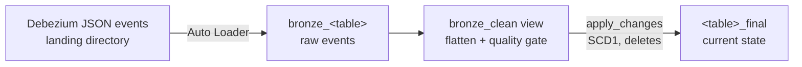

# dlt-debezium-mysql — single-table Debezium CDC pipeline

A self-contained, single-file Delta Live Tables pipeline that ingests
Debezium (MySQL) change-data-capture events for **one source table**
into a Unity Catalog bronze/silver pair. It is the compact counterpart
to a metadata-driven multi-table framework
([debezium-cdc-pipeline](https://github.com/morillo/debezium-cdc-pipeline)):
same CDC semantics, minimal moving parts — one Python file, one
pipeline per table.

## What it does



- **Schema derivation**: the payload schema is built from the Debezium
  envelope's embedded `schema` field, read from the most recently
  written event file — no manual schema maintenance.
- **Type handling**: covers all Kafka Connect physical types and
  converts Debezium logical types (`io.debezium.time.Date`,
  `Timestamp`, `MicroTimestamp`, `ZonedTimestamp`) into real Spark
  dates/timestamps. For MySQL `DECIMAL` columns set
  `decimal.handling.mode=string` on the connector.
- **Deterministic ordering**: events are sequenced by
  `struct(ts_ms, source.pos)` so same-millisecond changes to a row
  resolve by binlog position.
- **Deletes and tombstones**: deletes use the `before` row image and
  are applied to the target; Kafka tombstones and malformed events
  (`op IS NULL`) are dropped and counted in the event log.

## Configuration

Everything is parameterized — there is nothing to edit in the Python
file. The bundle exposes each setting as a variable:

| Bundle variable | Pipeline setting | Default |
|---|---|---|
| `catalog` | (pipeline catalog) | `cdc_dev` |
| `target_schema` | (pipeline schema) | `cdc_single` |
| `landing_root` | `pipeline.landing_root` | `/Volumes/cdc_dev/landing/debezium` |
| `database` | `pipeline.database` | `inventory` |
| `tablename` | `pipeline.tablename` | `customers` |
| `tablekeys` | `pipeline.tablekeys` | `id` |

Events are expected under `<landing_root>/mysql.<database>.<tablename>/`
(override the subdirectory with the optional `pipeline.topic` setting).
One deployed pipeline ingests one table; deploy the bundle once per
table with a different `--var="tablename=..."`.

## Deploy and run

```bash
databricks bundle validate -t dev
databricks bundle deploy   -t dev --var="tablename=customers"
databricks bundle run      -t dev dlt_debezium_mysql \
  --var="tablename=customers"
```

Targets `test` and `prod` follow the same SDLC layout as the
multi-table framework (production mode, service principals, own
catalogs); fill in the `workspace.host` values in `databricks.yml`.

### Databricks Free Edition

Verified end-to-end on Databricks Free Edition (serverless). Use the
built-in `workspace` catalog (Free Edition cannot create catalogs via
the CLI) and a Unity Catalog volume for landing:

```bash
databricks schemas create landing workspace
databricks schemas create cdc_single workspace
databricks volumes create workspace landing debezium MANAGED

databricks fs cp -r ./events/ \
  dbfs:/Volumes/workspace/landing/debezium/

databricks bundle deploy -t dev \
  --var="catalog=workspace" \
  --var="landing_root=/Volumes/workspace/landing/debezium"
databricks bundle run -t dev dlt_debezium_mysql \
  --var="catalog=workspace" \
  --var="landing_root=/Volumes/workspace/landing/debezium"
```

The verification run ingested snapshot reads, inserts, an update, a
delete, a same-millisecond update+delete pair (resolved correctly by
binlog position), and a Kafka tombstone; the final table held exactly
the expected current rows with proper timestamp/date types.

## Layout

```
dlt-debezium-mysql/
├── databricks.yml                       # Asset Bundle: dev/test/prod
├── resources/dlt_pipeline.pipeline.yml  # Pipeline resource
└── src/dlt_pipeline_debezium_mysql.py   # The entire pipeline
```

## Notes

- Uses the classic `dlt` Python API (`@dlt.table`, `apply_changes`),
  which current runtimes expose as a legacy alias of Lakeflow
  Declarative Pipelines. The multi-table framework linked above shows
  the same patterns on the newer `pyspark.pipelines` API.
- The schema is fixed at update start (taken from the newest file);
  picking up newly added upstream columns requires a pipeline restart.
  The multi-table framework uses Auto Loader schema evolution instead.
- Changing `tablekeys` for an existing deployment requires a full
  refresh to rewrite the target table.
